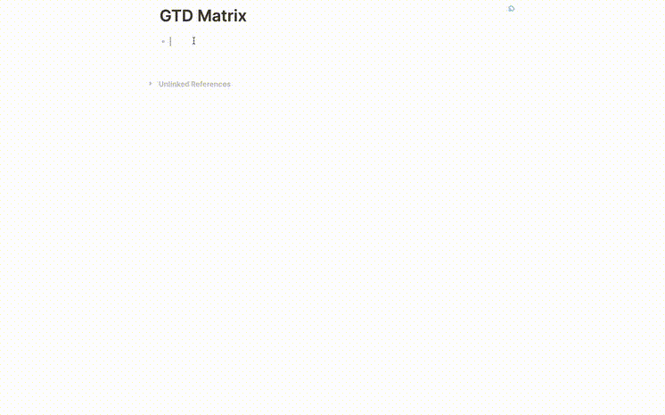

# LogWidgets

## Installation

### Preparation

1. Click the 3 dots in the righthand corner and go to Settings.
2. Got to advanced and enable Developer mode.
3. Restart the app.
4. Click 3 dots and go to Plugins.

### Install plugins from Marketplace (recommended)

1. Click Marketplace button and then click Plugins.
2. Find the plugin and click Install.

### Install plugins manually

1. Download released version assets from Github.
2. Unzip it.
3. Click Load unpacked plugin, and select destination directory to the unziped folder.

## Features

- [x] GTD Matrix

## GTD Matrix

The function-related styles are derived from cannibalox's
article [\[css+template\] eisenhower matrix](https://discuss.logseq.com/t/css-template-eisenhower-matrix/526)  
If you need more friendly view result through the query function, please refer to
article [OKR + GTD + Note => Logseq](https://www.bmpi.dev/self/okr-gtd-note-logseq/)
